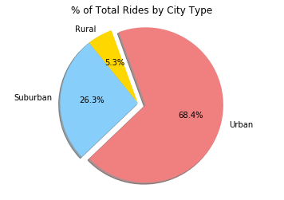

```python
# dependencies
import matplotlib.pyplot as plt
import pandas as pd
import numpy as np
```


```python
# read csv files
ride_data="ride_data.csv"
city_data="city_data.csv"
ride_df=pd.read_csv(ride_data)
city_df=pd.read_csv(city_data)
```


```python
# merge files and group by city
merged_df = pd.merge(city_df, ride_df, how="outer", on="city")
pyber_df = merged_df.groupby(["city"])
```


```python
# calculations for bubble plot
avg_fares=pyber_df["fare"].mean()
rides_city=pyber_df["city"].count()

drivers_city=city_df[["city", "driver_count"]].drop_duplicates("city").set_index("city")["driver_count"]
city_type=city_df[["city", "type"]].drop_duplicates("city").set_index("city")["type"]


bubble_df=pd.DataFrame({"Average Fare":avg_fares,"Rides":rides_city,"Drivers":drivers_city,"City Type":city_type})
bubble_df.head()

```


<div>
<style scoped>
    .dataframe tbody tr th:only-of-type {
        vertical-align: middle;
    }

    .dataframe tbody tr th {
        vertical-align: top;
    }

    .dataframe thead th {
        text-align: right;
    }
</style>
<table border="1" class="dataframe">
  <thead>
    <tr style="text-align: right;">
      <th></th>
      <th>Average Fare</th>
      <th>City Type</th>
      <th>Drivers</th>
      <th>Rides</th>
    </tr>
  </thead>
  <tbody>
    <tr>
      <th>Amandaburgh</th>
      <td>24.641667</td>
      <td>Urban</td>
      <td>12</td>
      <td>18</td>
    </tr>
    <tr>
      <th>Barajasview</th>
      <td>25.332273</td>
      <td>Urban</td>
      <td>26</td>
      <td>22</td>
    </tr>
    <tr>
      <th>Barronchester</th>
      <td>36.422500</td>
      <td>Suburban</td>
      <td>11</td>
      <td>16</td>
    </tr>
    <tr>
      <th>Bethanyland</th>
      <td>32.956111</td>
      <td>Suburban</td>
      <td>22</td>
      <td>18</td>
    </tr>
    <tr>
      <th>Bradshawfurt</th>
      <td>40.064000</td>
      <td>Rural</td>
      <td>7</td>
      <td>10</td>
    </tr>
  </tbody>
</table>
</div>


```python
#Separate data by city type
urban_df = bubble_df.loc[bubble_df["City Type"] == "Urban"]
suburban_df = bubble_df.loc[bubble_df["City Type"] == "Suburban"]
rural_df = bubble_df.loc[bubble_df["City Type"] == "Rural"]
```


```python
#bubble plot
plt.figure(figsize=(8,6))
plt.scatter(x=urban_df["Rides"], y=urban_df["Average Fare"], s=urban_df["Drivers"]*10, color="lightcoral", alpha=0.5, edgecolor="black", label="Urban")
plt.scatter(x=suburban_df["Rides"], y=suburban_df["Average Fare"], s=suburban_df["Drivers"]*10, color="lightskyblue", alpha=0.5, edgecolor="black", label="Suburban")
plt.scatter(x=rural_df["Rides"], y=rural_df["Average Fare"], s=rural_df["Drivers"]*10, color="gold", edgecolor="black", alpha=0.5, label="Rural")

plt.xlim(0, 40)
plt.ylim(15, 45)
plt.title('Pyber Ride Sharing Data (2016)')
plt.xlabel('Total Number of Rides (Per City)')
plt.ylabel('Average Fare ($)')
plt.legend(loc="upper right")
plt.tight_layout()
plt.text(42, 30, "Note: Circle size correlates with driver count per city.")
plt.show()
```


```python
# pie chart #1
type_df=merged_df.groupby("type")
fares_type=type_df["fare"].sum()
labels=fares_type.index
colors=["gold", "lightskyblue", "lightcoral"]
explode=(0, 0, 0.1)
plt.pie(fares_type, startangle=110, colors=colors, explode=explode, labels=labels, autopct = "%1.1f%%", shadow=True)
plt.title("% of Total Fares by City Type")
plt.axis("Equal")
plt.show()
```


```python
# pie chart #2
rides_df=bubble_df.groupby("City Type")
rides_type=rides_df["Rides"].sum()
labels=rides_type.index
colors=["gold", "lightskyblue", "lightcoral"]
explode=(0, 0, 0.1)
plt.pie(rides_type, startangle=110, colors=colors, explode=explode, labels=labels, autopct = "%1.1f%%", shadow=True)
plt.title("% of Total Rides by City Type")
plt.axis("Equal")
plt.show()
```





```python
# pie chart #3
drivers_type=rides_df["Drivers"].sum()
labels=drivers_type.index
colors=["gold", "lightskyblue", "lightcoral"]
explode=(0, 0, 0.1)
plt.pie(drivers_type, startangle=110, colors=colors, explode=explode, labels=labels, autopct = "%1.1f%%", shadow=True)
plt.title("% of Total Drivers by City Type")
plt.axis("Equal")
plt.show()
```


